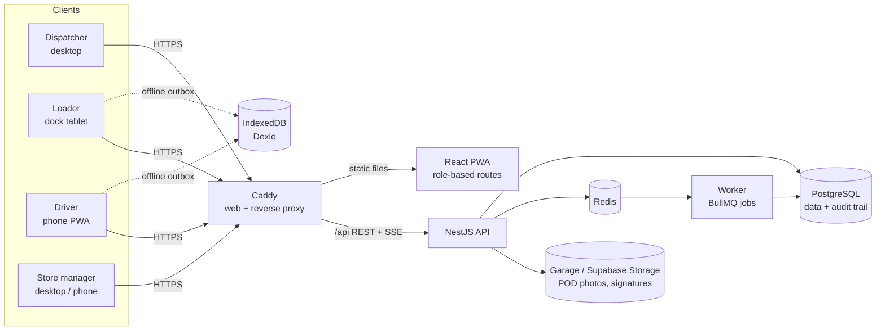
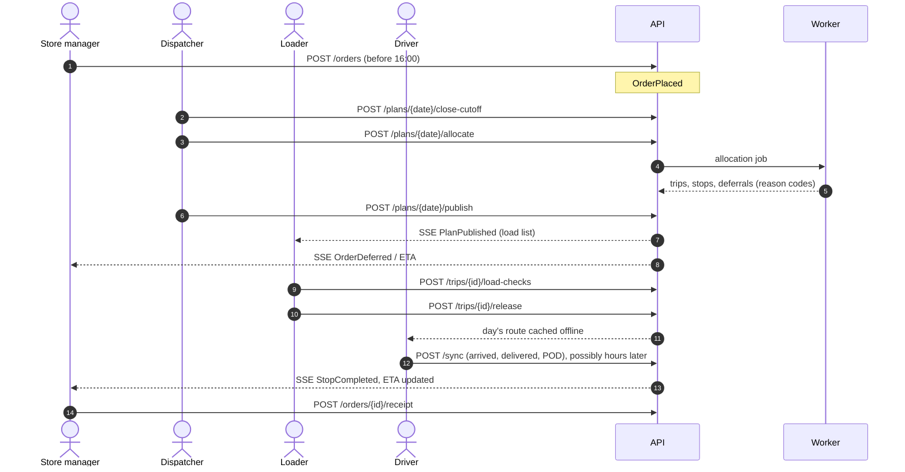

# Architecture

Waypoint is a **modular monolith**: one React PWA for all four roles, one NestJS API, and a worker process that shares the API's codebase. PostgreSQL is the system of record. Redis carries background jobs and real-time fan-out, and S3-compatible storage holds proof-of-delivery files.

## System context



| Component | Tech | Responsibility |
| --- | --- | --- |
| Web (`apps/frontend`) | React 19, Vite, React Router, TanStack Query | One responsive app with a layout per role. Driver and loader flows are phone-first and work offline (service worker + IndexedDB outbox). |
| API (`apps/backend`) | NestJS 11, Drizzle ORM | REST under `/api/v1`, OpenAPI at `/api/docs`, SSE for live updates, RBAC (role + scope). |
| Worker (`apps/backend`, `dist/worker.js`) | NestJS application context, BullMQ | Allocation runs, notifications, outbox relay, nightly audit hash-chain verification. |
| Shared (`packages/shared`) | TypeScript, Zod | Domain enums, **constraint validator** and trip-time rules, sync payload schemas. The same code runs in the UI, the API and the Datathon Task 2B check. |
| PostgreSQL | 17 | Master data, operational data, append-only audit trail, transactional outbox. |
| Redis | 7 | BullMQ queues; pub/sub so SSE works across API replicas. |
| Object storage | Garage locally, Supabase Storage in production | Private POD bucket; the API hands out short-lived signed URLs. |
| Caddy | 2 | Same-origin serving (cookie sessions, no CORS) and automatic HTTPS. |

## Backend modules

Each module owns its tables and exposes a service. Modules talk through services and in-process domain events, never through each other's tables.

| Module | Owns | Key responsibilities |
| --- | --- | --- |
| Identity | users, sessions, roles, scopes | Better Auth login, `@Roles()` guard, scope filter (outlet / depot / vehicle) |
| Master data | depots, outlets, vehicles, calendar, district travel, service allowance | CSV import and seed, read APIs |
| Ordering | orders, order lines | Place and edit before the 4 PM cutoff, confirmation, cutoff close |
| Planning | plans, trips, stops, deferrals | Allocation engine, constraint validator, manual overrides, reason codes |
| Fleet | fuel ledger, vehicle status | Weekly fuel quota, workshop status |
| Loading | load checks | Load list in reverse stop order, flag missing or damaged items, release vehicle |
| Execution | stop events, proof of delivery | Arrive, deliver, fail, POD, ETA recalculation |
| Receipt | receipts | Confirm receipt, report issues, disputes |
| Sync | idempotency keys | `POST /api/v1/sync` batch replay, conflict rules |
| Notifications | notifications | In-app feed, SSE fan-out per role and scope |
| Audit | audit events | Same-transaction, append-only, hash-chained record of every change |
| Forecasting (stretch) | forecasts | Capacity planning view from Datathon output or a baseline |

## How the roles connect

Domain events connect the roles. Each state change writes an `audit_event` and an `outbox_event` in the same transaction. The worker relays outbox events every second to the consumers registered on the `EventBus` and to Redis for SSE subscribers (docs/events.md).



## Offline operation (driver and loader)

1. **Pre-load.** When the loader releases a vehicle, the driver's phone downloads the whole day (trips, stops, order lines) into IndexedDB and shows "ready offline".
2. **Write local first.** Every action updates the local stop and appends to the outbox with a `client_uuid` and the device time. The UI never waits on the network.
3. **Background sync.** Once online, the outbox flushes in order to `POST /api/v1/sync`. Photos upload separately and link by `client_uuid`.
4. **Idempotent server.** The unique constraint on `client_uuid` means a replayed event is acknowledged and ignored.
5. **Conflict rules.** Plan data is server-wins. Stop events are append-only. An event for a reassigned stop is accepted, audited, and flagged for the dispatcher.
6. **Visible state.** An online/offline badge and a "N actions waiting to sync" count are always visible. On a 401 after reconnecting, the app prompts for login and then replays the queue. Queued events are never dropped.

## Allocation engine (outline)

The engine is deterministic and explainable: feasible and well-reasoned rather than optimal.

1. Load confirmed orders for the date and depot, available vehicles, and fuel left this ISO week.
2. Group by brand + district (one trip = one brand, one district).
3. Score priority: deferred yesterday, days since last served, chilled Fresh, tight or mall windows, order age.
4. Pack each group first-fit decreasing into compatible vehicles (reefer for chilled, van for `van_only`, weight *and* volume caps).
5. Compute trip minutes (`tripMinutes()` in `@waypoint/shared`). Check the Fresh 270-minute and Style + Tech 480-minute budgets, the two-trip limit, and the fuel quota.
6. Anything that does not fit becomes a deferral with a reason code (`NO_REEFER_CAPACITY`, `VAN_SHORTAGE`, `OVER_CAPACITY`, `TIME_BUDGET`, `WINDOW_CONFLICT`, `FUEL_QUOTA`, `VEHICLE_BREAKDOWN`, from the engine's reason map in `packages/engine/src/rules/reason-map.ts`; admins add their own in `deferral_reasons`).
7. The dispatcher can move orders between trips. The shared validator rejects any move that breaks a rule and names the rule.

## Observability

- **Health:** `GET /health` (readiness: DB + Redis) and `GET /health/live` (liveness), used by Compose healthchecks and Kubernetes probes.
- **Metrics:** `GET /metrics` (prom-client), scraped by Prometheus.
- **Logs:** JSON to stdout, shipped by Grafana Alloy to Loki.
- **Dashboards:** Grafana. Locally: `docker compose --profile observability up`, then http://localhost:3001.

Logs are for engineers and they expire. The audit trail is the business record, and it doesn't.

## Repository layout

```
apps/
  backend/        NestJS API + worker (Drizzle schema, migrations, seed)
  frontend/       React PWA (four role views)
packages/
  shared/         Domain types, constraint validator, Zod schemas
data/seed/        Shared challenge datasets loaded by the seed job
datathon/         Datathon notebooks, models, submissions (data git-ignored)
deploy/           Caddyfile, database roles, observability configs, Kubernetes manifests
docs/             This documentation
docker-compose.yml, .env.example
```
