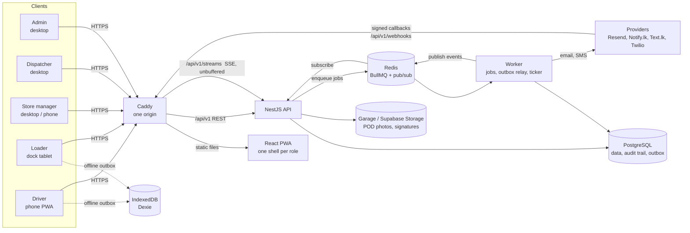
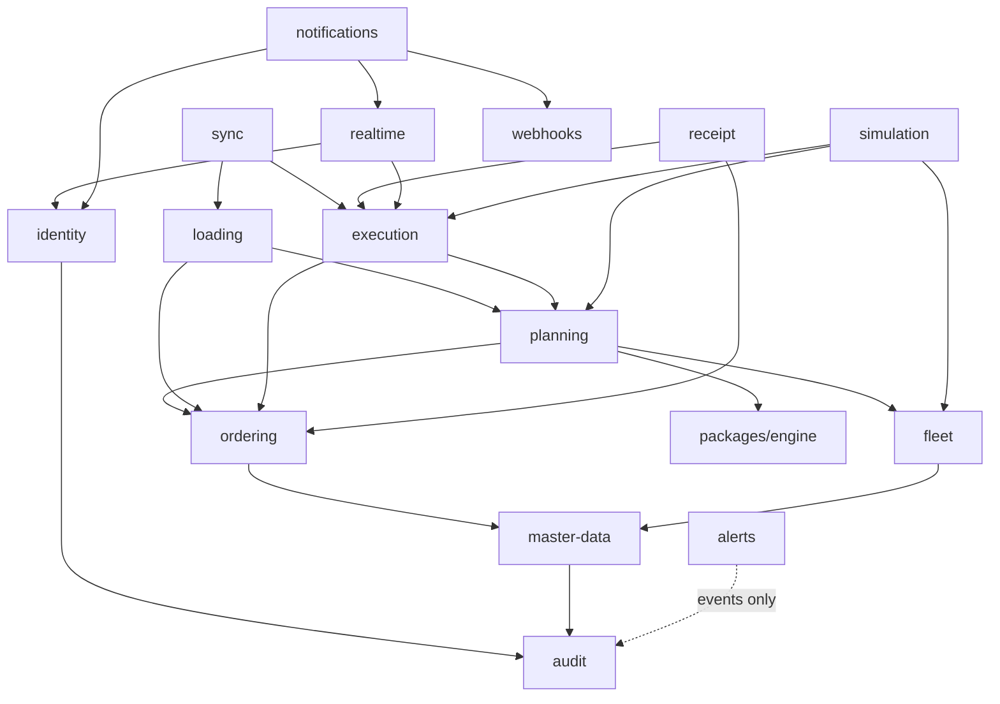
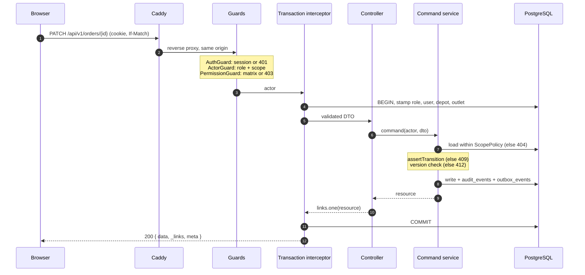
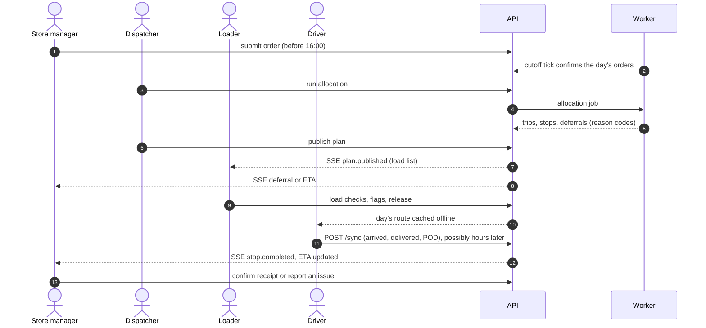

# Architecture

Waypoint Compass is a **modular monolith**: one React PWA for all five roles, one NestJS API, and a worker process built from the same codebase. PostgreSQL is the system of record. Redis carries background jobs and real-time fan-out, and S3-compatible storage holds proof-of-delivery files. The planning rules live in one pure TypeScript package that the API, the worker and the browser all run.

## System context



| Component | Tech | Responsibility |
| --- | --- | --- |
| Web (`apps/frontend`) | React 19, Vite, React Router, TanStack Query | One responsive app with a shell per role. Driver and loader flows are phone-first and work offline (service worker + IndexedDB outbox). |
| API (`apps/backend`, `main.ts`) | NestJS 11, Drizzle ORM | REST under `/api/v1`, OpenAPI at `/api/docs`, SSE for live updates, permissions as role + scope. |
| Worker (`apps/backend`, `worker.ts`) | NestJS application context, BullMQ | Allocation runs, notification delivery, the outbox relay, the one-minute ticker (cutoff, reminders, watches) and the simulator loop. |
| Engine (`packages/engine`) | Pure TypeScript | The 18 planning rules, the validator, the allocator and the manual-edit helpers. No I/O and no clock of its own, so the same code runs in the API, the worker and the planning wizard in the browser. |
| Shared (`packages/shared`) | TypeScript, Zod | Domain enums, state machines, the permission matrix, business-time helpers and sync payload schemas. |
| API client (`packages/api-client`) | orval, MSW | Hooks and mocks generated from `apps/backend/openapi.json`; screens get data only through them. |
| UI tokens (`packages/ui-tokens`) | Tailwind 4 theme | Compass colours and text styles exported from the Figma variables. |
| PostgreSQL | 17 | Master data, operational data, append-only audit trail, transactional outbox, row-level security. |
| Redis | 7 | BullMQ queues; pub/sub so SSE works across API replicas. |
| Object storage | Garage locally, Supabase Storage in production | Private POD bucket; the API hands out short-lived signed URLs. |
| Caddy | 2 | Same-origin serving (cookie sessions, no CORS) and automatic HTTPS. |

## Backend modules

Sixteen modules under `apps/backend/src/modules`, each with a spec in [`specs/`](../specs/README.md) that holds its acceptance criteria.

| Module | Owns | Key responsibilities |
| --- | --- | --- |
| identity | users, sessions, invitations, devices, settings | Better Auth sign-in (password, driver SMS code, dock PIN), the permission matrix, scopes, the demo clock |
| audit | audit events | Same-transaction, append-only, hash-chained record of every change; order timelines |
| master-data | depots, districts, outlets, calendar, travel and service tables, item catalog | Dataset import and seed, read APIs, admin edits |
| ordering | orders, order lines, presets | Place and edit before the 4 PM cutoff, cutoff close, the dispatcher's queue; exports `OrderLifecycleService` |
| fleet | vehicles, fuel ledger | Vehicle status, weekly fuel quota, breakdowns as events |
| planning | plans, trips, stops, deferrals | Wraps the engine: allocation, manual edits, publish, revisions, live-day tracking, closing the day; exports `TripLifecycleService` |
| forecasting | forecasts | Volume against fleet capacity. Scaffold only: no endpoints yet |
| loading | load lists, load checks, load flags | Load list in reverse stop order, the flag-and-decide loop, release |
| execution | stop events, proof of delivery, positions | Arrive, deliver, fail, POD, pings, ETA |
| sync | sync batches, idempotency | `POST /sync` replays a device's offline records exactly once, in device order |
| receipt | receipts, issues | Confirm receipt line by line, report issues, issue threads |
| alerts | alerts | Turns other modules' events into one dispatcher list; alerts close themselves when the fix happens |
| notifications | notifications, preferences | Catalog-driven in-app, email and SMS delivery from worker jobs |
| webhooks | inbound webhook events | Verified provider callbacks (Resend), stored once. Signed outbound webhooks are specified, not built |
| realtime | none | One authenticated SSE stream per client, with replay by `Last-Event-ID` |
| simulation | simulation runs | Virtual drivers that play a delivery day through the public APIs; an optional LLM scenario director, off by default |

### Module boundaries

- A module imports another only through its `index.ts`, and only if the other is listed in the `depends-on` line of its own spec. `pnpm --filter api check:boundaries` reads those lines and fails the build on any other import; it runs in `pnpm check` and CI.
- A module writes only its own tables. When another module must move a status, it calls the owner's lifecycle service (`OrderLifecycleService`, `TripLifecycleService`).
- When a module only needs another to react, it emits a domain event instead of importing it (next section).
- Outside services sit behind ports in `apps/backend/src/core/providers` (SMS, email, LLM). An environment variable picks the adapter, and the local default needs no key.



(Every module also depends on audit and the core kernel; those arrows are left out where another is drawn.)

## Request lifecycle

Every HTTP request passes through the same pipeline, registered once in `core/core.module.ts`. A module's controller and service only fill in the two middle steps.



1. **Authentication.** Better Auth resolves the cookie session; no session is 401 unless the route is `@AllowAnonymous`.
2. **Authorisation.** `ActorGuard` builds the actor (role and scope). `PermissionGuard` checks `@RequirePermission` against the matrix in `packages/shared`; a missing permission is 403.
3. **Transaction.** `ActorTransactionInterceptor` opens one transaction per request and stamps the actor into it, so PostgreSQL's row-level security filters every query ([data-model.md](data-model.md#database-roles-and-row-level-security)).
4. **Controller.** HTTP only: it validates the DTO and calls one service method.
5. **Service.** Reads go through the module's `ScopePolicy`, so a row outside the actor's scope is 404. A command checks the state machine, writes, and records an audit row and an outbox event in the same transaction: if any of the three fails, all roll back.
6. **Response.** `EnvelopeInterceptor` wraps the result as `{ data, _links, meta }`. The `_links` list the actions this actor may take next, and screens show a button only when its link is present. Errors are `DomainError` subclasses rendered as `application/problem+json`.
7. **Retries.** Creates and non-repeatable actions take an `Idempotency-Key`; versioned writes take `If-Match`.

The conventions are in [`specs/api-conventions.md`](../specs/api-conventions.md).

## How the roles connect

Domain events connect the roles. Each state change writes an `audit_event` and an `outbox_event` in the same transaction. The worker relays outbox events every second to the consumers registered on the `EventBus` and to Redis for SSE subscribers ([events.md](events.md)).



## Realtime path

1. A command commits its `outbox_events` row with the change.
2. The worker's `OutboxRelay` claims rows with `FOR UPDATE SKIP LOCKED`, delivers each to its in-process consumers (alerts, loading, receipt, planning, notifications), then publishes it on the Redis channel `waypoint:events`.
3. Each API instance holds one Redis subscriber and fans events out to its open `GET /api/v1/streams/me` connections, filtered by the channels the client's role and scope allow.
4. The browser's `EventSource` reconnects on its own and sends `Last-Event-ID`; the server replays what was missed from the outbox, or tells the client to resync. No screen polls, and no instance needs sticky sessions.
5. Caddy proxies `/api/v1/streams/*` without compression or buffering, so frames flush at once.

## Webhook path

Provider callbacks arrive at `/api/v1/webhooks/<provider>`. The body is read raw (mounted in `app.setup.ts` before any JSON parser) so the signature can be checked over the exact bytes. The gateway verifies the signature, stores the event once keyed by the provider's event id, and answers at once. Today this carries Resend's delivery receipts, bounces and complaints into notifications, which suppresses addresses that bounce. Signed outbound webhooks in the Standard Webhooks format are specified in [`specs/webhooks/spec.md`](../specs/webhooks/spec.md) and not built.

## Offline operation (driver and loader)

1. **Pre-load.** When the loader releases a vehicle, the driver's phone downloads the whole day (trips, stops, order lines) into IndexedDB and shows "ready offline".
2. **Write local first.** Every action updates the local stop and appends to the outbox with a `clientUuid` and the device time. The UI never waits on the network.
3. **Background sync.** Once online, the outbox flushes in order to `POST /api/v1/sync`. Photos upload separately and link by `clientUuid`.
4. **Idempotent server.** The unique constraint on `clientUuid` means a replayed event is acknowledged and ignored.
5. **Conflict rules.** Plan data is server-wins. Stop events are append-only. Each event applies in its own savepoint, so one bad event does not stop the rest. An event the server's state now contradicts (the stop was reassigned while the phone was away) comes back to the device as a `conflict` and is left unapplied. Letting the dispatcher keep the device's or the server's version (screen 19c) is specified and not built.
6. **Visible state.** An online/offline badge and a "N actions waiting to sync" count are always visible. On a 401 after reconnecting, the app prompts for sign-in and then replays the queue. Queued events are never dropped.

## Allocation engine (outline)

The engine is deterministic and explainable: feasible and well-reasoned rather than optimal. The rules, their fixtures and the allocator are specified in [`specs/engine/rules.md`](../specs/engine/rules.md).

1. Load confirmed orders for the date and depot, available vehicles, and fuel left this ISO week.
2. Pre-screen and rank: deferred on the last run, days since last served, chilled Fresh, tight or mall windows, order age.
3. Group by brand and district, then pack each group into compatible vehicles (reefer for chilled, van for van-only outlets, weight and volume caps).
4. Every candidate trip goes through `fits()`, which sequences the stops, measures the trip and runs the hard rules: the Fresh 270-minute and Style + Tech 480-minute budgets, delivery and mall windows, the two-trip limit and the fuel quota.
5. Anything that does not fit becomes a deferral with a reason code and the rule that bound it (`NO_REEFER_CAPACITY`, `VAN_SHORTAGE`, `OVER_CAPACITY`, `TIME_BUDGET`, `WINDOW_CONFLICT`, `FUEL_QUOTA`, `VEHICLE_BREAKDOWN`, from `packages/engine/src/rules/reason-map.ts`; admins add their own in `deferral_reasons`).
6. The dispatcher can move orders between trips. The same validator rejects any move that breaks a rule and names the rule; nothing outside `packages/engine` re-implements one.
7. The same input always gives byte-identical output, whatever order the orders arrive in.

## Time

Business dates are Asia/Colombo. The API reads time only from `ClockService.now()` and the web from `useServerClock()`, and scheduled work runs from the worker's one-minute ticker using the `now` it is handed. That is what lets the demo clock (Settings › Demo › Time travel) move the whole system past the 4 PM cutoff at any time of day.

## Observability

- **Health:** `GET /health` (readiness: DB + Redis) and `GET /health/live` (liveness), used by Compose healthchecks.
- **Metrics:** `GET /metrics` (prom-client), scraped by Prometheus.
- **Logs:** JSON to stdout with a correlation id and no personal data, shipped by Grafana Alloy to Loki.
- **Dashboards:** Grafana. Locally: `docker compose --profile observability up`, then http://localhost:3001.

Logs are for engineers and they expire. The audit trail is the business record, and it doesn't.

## Repository layout

```
apps/
  backend/        NestJS API + worker (Drizzle schema, migrations, seed)
  frontend/       React PWA (five role shells)
packages/
  engine/         Planning rules, validator, allocator (pure TypeScript)
  shared/         Enums, state machines, permission matrix, Zod schemas
  api-client/     Hooks and MSW mocks generated from openapi.json
  ui-tokens/      Compass design tokens
data/seed/        Challenge datasets read by the seed (git-ignored, not in the repository)
deploy/           Caddyfile, database roles, object storage setup, observability configs
docs/             This documentation
specs/            One spec per module, with acceptance criteria
docker-compose.yml, .env.example
```
