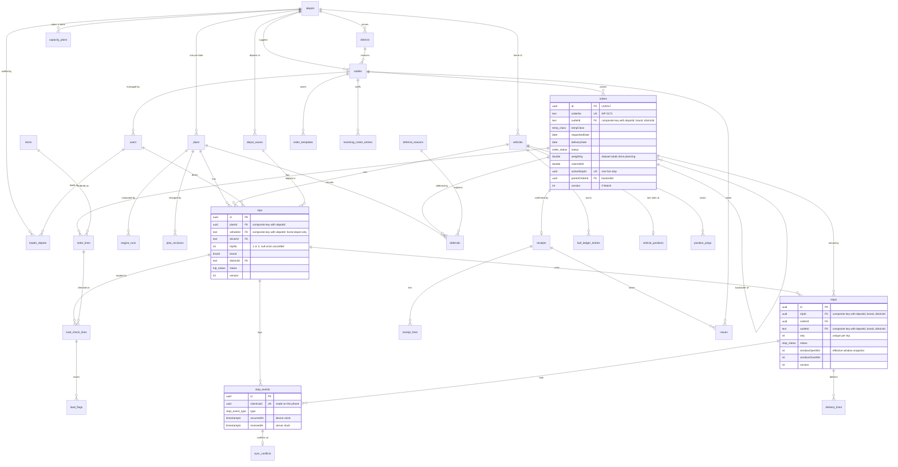
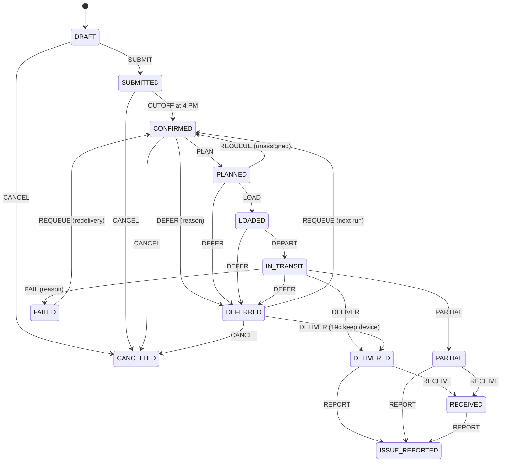

# Data model

PostgreSQL 16+ with Drizzle ORM. The schema is one TypeScript file per module in [`apps/backend/src/db/schema/`](../apps/backend/src/db/schema/): 57 tables, 44 enums, 3 order-number sequences, and every check, index and row-level security policy declared next to its table. Generated SQL migrations are committed in `apps/backend/drizzle/`. The schema froze on Wed 30 Sep 2026 at 12:00, so from now on migrations are additive only.

The baseline is two migrations:

| Migration | What it does |
| --- | --- |
| `202609301706_platform_init.sql` | Generated by drizzle-kit: every table, enum, sequence, check, index, foreign key and policy |
| `202609301707_platform_integrity.sql` | Hand-written: the append-only trigger on `audit_events` and the grants for the three database roles |

## Entity relationships

Orders flow from outlets into a plan's trips as stops. Everything that happens to a stop afterwards hangs off it as events, delivery lines and a receipt.

Identity (`users`, `sessions`, `accounts`, `verifications`, `invitations`, `devices`) follows BetterAuth's schema plus scope columns. The platform tables (`audit_events`, `outbox_events`, `idempotency_keys`, `attachments`, `settings`, `comments`, `notifications`, `alerts`, the webhook and simulation tables) point at entities by `(type, id)` rather than by foreign key, so any entity can be audited, attached to, commented on or alerted on. They are left out of the diagram for readability.

## Schema files and owners

A module writes only its own tables. Planning owns trips and stops; loading and execution change them only through planning's `TripLifecycleService`.

| File (`src/db/schema/`) | Tables | Owner |
| --- | --- | --- |
| `enums.ts`, `relations.ts`, `index.ts`, plus `../columns.ts`, `../rls.ts`, `../actor.ts` | Every enum, the query relations, column helpers, roles, policy predicates, actor stamping | Nimesha |
| `identity.ts` | users, loader_depots, sessions, accounts, verifications, invitations, devices | Nimesha |
| `audit.ts` | audit_events | Nimesha |
| `platform.ts` | outbox_events, idempotency_keys, attachments, settings, comments | Nimesha |
| `notifications.ts` | notifications, notification_preferences | Nimesha |
| `webhooks.ts` | inbound_webhook_events, webhook_endpoints, webhook_deliveries | Nimesha |
| `master-data.ts` | depots, depot_waves, districts, service_allowances, traffic_speeds, road_conditions, calendar_days, outlets, items | Harini |
| `ordering.ts` | orders, order_lines, order_templates, order_template_lines, receiving_roster_entries, order_day_marks | Harini |
| `loading.ts` | load_check_lines, load_flags | Harini |
| `receipt.ts` | receipts, receipt_lines, issues | Harini |
| `alerts.ts` | alerts | Harini |
| `fleet.ts` | vehicles, fuel_ledger_entries | Tihara |
| `planning.ts` | plans, plan_revisions, engine_runs, trips, stops, deferrals, deferral_reasons | Tihara |
| `forecasting.ts` | demand_forecasts, capacity_plans | Tihara |
| `execution.ts` | stop_events, delivery_lines, vehicle_positions, position_pings | Aniqa |
| `sync.ts` | sync_batches, sync_conflicts | Aniqa |
| `simulation.ts` | simulation_runs, simulation_injections | Aniqa |

## Conventions

| Topic | Convention |
| --- | --- |
| Names | Tables are snake_case plural (`orders` also sidesteps the reserved word). Columns keep the camelCase TypeScript keys, so raw SQL quotes them: `"windowCloseMin"`. |
| Keys | Dataset rows keep natural keys (`OUT001`, `VEH001`, district slugs, depots `PLG` and `KDY`). Everything else is a UUIDv7 from `pk()`, so ids sort by creation time. |
| Offline ids | Rows created on a phone or tablet carry a client-generated `clientUuid` with a unique index, so a replayed sync batch is a no-op. |
| Time | `instant()` is `timestamptz` in UTC, shown in Asia/Colombo. `businessDate()` is a plain `YYYY-MM-DD` Colombo date. Clock times (windows, waves) are minutes after midnight via `minutes()`: 05:30 is 330. |
| Quantities | `measure()` (`double precision`) for kg, m³, km, litres and durations; `integer` for units and LKR. |
| Versions | `version()` on every aggregate more than one person edits (orders, plans, trips, stops, vehicles). It drives `ETag` and `If-Match`. |
| Deletes | No hard deletes on business records. They move to `CANCELLED`, so offline clients learn that a stop went away and the audit trail stays whole. |
| Actor columns | `*ById` columns are plain ids, with foreign keys only where a screen joins them (trip driver, order placer, receipt, invitation). The audit trail is the authoritative who. |
| Enums | Postgres enums, upper case. `packages/shared` keeps the same arrays for the web app; `enums.spec.ts` fails if the two drift. Dataset codes are upper-cased at import (`van_only` becomes `VAN_ONLY`). |
| Row types | `typeof orders.$inferSelect` and `$inferInsert`, never hand-written interfaces. |

## What the database enforces

Four booklet rules and several integrity rules are refused by Postgres itself, whatever the application does. `src/db/__tests__/database.spec.ts` proves each one against a real database.

| Rule | How |
| --- | --- |
| A vehicle serves only its home depot | `trips (vehicleId, depotId)` references `vehicles (id, depotId)`, and `trips (planId, depotId)` references `plans (id, depotId)` |
| One brand and one district per trip | `stops (tripId, depotId, brand, districtId)` references `trips`, and `stops (outletId, depotId, brand, districtId)` references `outlets` |
| An order matches its outlet | `orders (outletId, depotId, brand, districtId)` references `outlets` |
| At most two trips per vehicle per day | `trips_vehicle_slot_uq (planId, vehicleId, tripNo)` plus `CHECK (tripNo IN (1, 2))`; cancelling clears `tripNo` and frees the slot |
| Whole orders, one trip each | `stops_live_order_uq`: one stop per order that is not `CANCELLED` or `FAILED`, plus a unique `orders.activeStopId` |
| Distinct stop positions | `stops_trip_seq_uq (tripId, seq)`; cancelled stops set `seq` to null, and re-sequencing writes negative values first, in one transaction |
| One plan per depot and date | `plans_depot_date_uq` |
| One capacity plan per depot and ISO week | `capacity_plans_uq` |
| One receipt per order | `receipts.orderId` is unique |
| One unresolved alert per dedupe key | `alerts_open_dedupe_uq` on `dedupeKey` where the status is not `RESOLVED`; raising again is an upsert |
| Offline replays apply once | Unique `clientUuid` on stop events, load lines, load flags, attachments and comments; unique `(vehicleId, recordedAt)` on pings |
| Valid windows, sizes and totals | `CHECK` constraints: window close after open, mall window both-or-neither, positive capacities, item sizes and service allowances, weekdays 0 to 6, non-negative totals, quantities and planned counts, late-risk probability 0 to 1, coordinates in range |
| The audit trail cannot change | A trigger raises on `UPDATE`, `DELETE` and `TRUNCATE` for every role, and `compass_app` holds only `INSERT` and `SELECT` |
| Stores and drivers see only their own orders | Row-level security on `orders`, `order_lines`, `deferrals`, `receipts` and `issues` (next section) |

The engine's validator and the services enforce the rest: capacity, reefer, van-only, delivery and mall windows, time budgets, fuel, vehicle availability and operating days, one non-cancelled order per outlet, requested date and class (backorders exempt), and order lines that match the order's class and the outlet's brand.

## Database roles and row-level security

The app decides who may do what. The database independently limits what the running code can touch.

| Role | Used by | Can |
| --- | --- | --- |
| `compass_owner` | Migrations, the seed, demo reset (`DIRECT_URL`) | Owns every table; the only role that changes the schema; bypasses row-level security as owner |
| `compass_app` | The API and the worker (`DATABASE_URL`) | Reads and writes business tables; `INSERT` and `SELECT` only on `audit_events`; no DDL; filtered by row-level security |
| `compass_readonly` | Grafana and reporting | `SELECT` everywhere except credentials, sessions, verifications, idempotency keys, devices (push keys) and webhook secrets, and only non-sensitive `users` columns |

[`deploy/db/roles.sql`](../deploy/db/roles.sql) creates the roles once per environment. Compose runs it through `deploy/db/init/00-roles.sh` when the Postgres volume is first created; CI runs it before `db:migrate`. Migrations never create roles (`rls.ts` declares them with `pgRole(...).existing()`).

Every request runs in one transaction stamped with the actor by `stampActor()` / `withActor()` in [`src/db/actor.ts`](../apps/backend/src/db/actor.ts): `set_config('app.role' | 'app.user_id' | 'app.depot_id' | 'app.outlet_id', ..., true)`. The setting is transaction-local, so it is safe behind Supabase's transaction pooler. The policies in [`src/db/rls.ts`](../apps/backend/src/db/rls.ts) read it back:

| Role stamped | Sees on `orders` |
| --- | --- |
| `admin`, `system` (worker jobs) | Every order |
| `dispatcher` | Their depot's orders, or every depot when their depot is empty |
| `loader` | Their depot's orders |
| `store_manager` | Their outlet's orders |
| `driver` | Orders with a stop on a trip they drive |
| nothing stamped | No rows (fail closed) |

`order_lines`, `deferrals` and `receipts` follow their order through a subquery, which the orders policy filters too. `issues` has its own predicate (outlet, depot or the driver's stops). On Supabase, the integrity migration also revokes `anon` and `authenticated`, and the Data API should be off.

## State machines

Every status column has a transition table in [`packages/shared/src/machines/`](../packages/shared/src/machines/). The same table drives `assertTransition()` in services (409 `CONFLICT_STATE` when an event isn't allowed), the `_links` a resource advertises, and the status chips in the UI.

`DEFERRED` also accepts `PARTIAL`, for a partial delivery kept after a sync conflict. `ISSUE_REPORTED` and `CANCELLED` are final.

| Machine | Main path | Branches |
| --- | --- | --- |
| Plan | DRAFT → PUBLISHED → CLOSED | REVISE while PUBLISHED raises `revision` |
| Trip | RESERVED → PLANNED → LOADING → RELEASED → IN_PROGRESS → COMPLETED | CANCEL before start; REASSIGN keeps the state; a released trip moved to another vehicle goes back to LOADING |
| Stop | PENDING → ARRIVED → DELIVERED, PARTIAL or FAILED | PENDING → CANCELLED when deferred mid-route or moved; CANCELLED → PENDING (REINSTATE) when a device's delivery is kept |
| Deferral | PROPOSED → CONFIRMED | PROPOSED → CANCELLED (planned after all, or swapped for another order; the swap is audited as planning.order.swapped); CONFIRMED → REVERSED (19c). One live (PROPOSED or CONFIRMED) whole-order deferral per order and plan (`deferrals_live_uq`); a dock's partial deferrals sit beside it |
| Store response | AWAITING → ACKNOWLEDGED or PRIORITY_REQUESTED | |
| Load flag | OPEN → AWAITING_RECHECK → RESOLVED | OPEN → RESOLVED on REMOVE, or on UNDO before the dispatcher decides |
| Alert | OPEN → ACKNOWLEDGED → RESOLVED | RESOLVE or AUTO_RESOLVE from OPEN too |
| Invitation | PENDING → ACCEPTED | PENDING → EXPIRED → PENDING on RESEND; PENDING or EXPIRED → REVOKED |

## Audit trail

1. **Same transaction.** Services write `audit_events` in the same transaction as the change. If the audit write fails, the change rolls back.
2. **Append-only.** The trigger blocks `UPDATE`, `DELETE` and `TRUNCATE` for every role, the owner included; `compass_app` holds only `INSERT` and `SELECT`.
3. **Tamper-evident.** `hash = sha256(prevHash + canonical row)`, with a unique `hash` and a gapless `seq`. A nightly worker job re-walks the chain.
4. **Mandatory reasons** for deferrals, manual overrides, edits after publish, failed or partial deliveries, missing or damaged items, cancellations and disputes (`reasonCode`, `reasonNote`).
5. **Two clocks.** `occurredAt` (device or business time) and `recordedAt` (set by the app, so the hash can be recomputed). Late offline events are flagged, not reordered.

## Migration workflow

Schema changes start in the module's schema file and reach every environment as committed SQL. Nobody edits a database by hand, and `drizzle-kit push` never touches a shared one.

| When | Command |
| --- | --- |
| You changed a schema file | `pnpm --filter api db:generate --name=<module>_<change>`, read the SQL, then `db:migrate` |
| You need SQL Drizzle can't declare (triggers, functions, grants) | `pnpm --filter api db:custom --name=<module>_<change>`, fill the empty file, then `db:migrate` |
| A teammate's migration landed | `git pull && pnpm --filter api db:migrate` |
| Your local database is a mess | `pnpm --filter api db:reset` (local only: drops, migrates, seeds) |
| CI | A fresh Postgres, `deploy/db/roles.sql`, `db:migrate`, then `db:generate` must find no changes, `db:check` must pass, the seed runs, and the database suite runs |
| Compose and production | The one-shot `seed` service runs `node dist/db/migrate.js` and the seed as `compass_owner`; `api` and `worker` start only after it succeeds |

`db:generate` wraps drizzle-kit and names each file `YYYYMMDDHHMM_<module>_<change>.sql` (UTC), with a module from the table above. Run without `--name`, it fails if the schema changed, which is the drift check.

1. After the 12:00 freeze, changes are additive: new nullable columns, tables and indexes. No renames or type changes before 4 Oct (they need add, backfill and drop across two migrations).
2. A migration that reached `main` is never edited.
3. One migration per PR. If `main` gains one first, rebase, delete your own SQL file, snapshot and journal entry, and re-run `db:generate` so yours sorts after it.
4. CI seeds a fresh database, so a migration that breaks the seed fails the PR.

## Assumptions and the schema review

The first draft (Supabase, 29 Sep) was reviewed against the Challenge Booklet, the user flows and the Figma file. The spine it had was right: orders → plan → trips → stops → delivery → receipt, with deferrals and load checks. This schema keeps that spine and makes these decisions:

| Review finding | Decision in this schema |
| --- | --- |
| No truck/van type; vehicles not tied to a depot | `vehicles.type` (`TRUCK`, `VAN`) and `depotId NOT NULL`, with the composite key from trips |
| Two sources of truth for temperature (`conditions`, `vehicle_conditions`, `is_refrigerated`) | One `temp_class` (`AMBIENT`, `CHILLED`) on items, orders and trips; `vehicles.temp` (`AMBIENT`, `REEFER`); the condition tables are dropped |
| Nothing stops five "trip 1"s, or an order on two live trips | `trips_vehicle_slot_uq` with the 1-or-2 check; `stops_live_order_uq` and `orders.activeStopId` |
| One brand and district per trip not enforced | `trips.districtId` plus the composite keys through `stops` |
| No travel times, service allowances, calendar or fuel record | `districts` (from `district_travel.csv`), `service_allowances`, `calendar_days`, `fuel_ledger_entries` by ISO week, planned km and minutes on trips |
| Order size only as lines × items | Totals on `orders` (the dataset's figures); lines snapshot unit weight, volume and value at submit |
| Drafts stamped as placed; no order number or cutoff flag | `DRAFT` status, nullable `submittedAt`, brand-prefixed `orderNo` from per-brand sequences, `requestedDate` against `deliveryDate`, `afterCutoff`, `urgent` |
| Deferral reason is free text | `deferral_reasons` table (admins add reasons in A6; engine reasons can't be removed), with source, status, from and to dates, repeat-skip override note, engine choice and binding rule, partial flag, store response and reversal |
| Screens with nowhere to save data | `order_templates`, `receiving_roster_entries`, `load_check_lines`, `load_flags`, `delivery_lines`, `receipt_lines`, `issues`, `alerts`, `attachments`, `invitations`, `devices`, `settings`, `comments`, `depot_waves`, `plan_revisions`, `engine_runs`, `demand_forecasts` |
| Arrival can't be saved before an outcome; no GPS | Append-only `stop_events` (ARRIVED first, with position), projected onto `stops.arrivedAt` and `outcome` |
| No version or soft status for offline sync, no conflict record | `version` on aggregates, `CANCELLED` instead of delete, `clientUuid` everywhere offline, `sync_batches` and `sync_conflicts` |
| Drivers hard-bound to one vehicle | `trips.driverId`; `users.defaultVehicleId` is only a default |
| `users.role` and four role tables can disagree | One `users.role` plus scope columns (`depotId`, `outletId`), as BetterAuth's admin plugin writes it |
| Email required, no phone or PIN | `phoneNumber` for driver OTP, `pinHash` for the loader's dock PIN, `devices.isDockDevice` for shared tablets |
| `receipt` could point at two orders; `load_check` defaulted to OK | `receipts.orderId` unique, the stop optional (`awaitingDriverSync`); load lines start `PENDING` |
| Mixed naming (`warehouse` against `depot_id`, singular and plural) | One vocabulary: depots, plural snake_case tables, camelCase columns |

Assumptions made where the booklet and the design disagree or are silent:

- **A stop is one order**, not one outlet visit. A Fresh outlet with a dry and a chilled order gets two stops on the same trip, which matches the booklet's Task 2B timing. The UI groups them by outlet (D1, L2, D4).
- **"Run" in the design is a depot departure wave** (`depot_waves`, Run 1 05:15–06:30, Run 2 11:00–12:30); a trip is one vehicle's trip. The seed's wave brands are a placeholder until A4's settings are confirmed.
- **Parking follows the dataset.** `parkingConstraint` is one of `NORMAL`, `VAN_ONLY`, `MALL_DOCK`, and the mall window is its own pair of columns. The effective window is the outlet window intersected with the mall window.
- **Vehicle status is persistent** (`ACTIVE`, `WORKSHOP`, `BREAKDOWN`) until someone marks the vehicle active again, and re-seeding never overwrites it.
- **Reefers carry chilled orders**; whether they may also carry ambient is an engine switch, not a schema rule.
- **Deferrals move an order to a date**, never to an earlier one (`toDate >= fromDate`).
- **Forecasts are weekly m³ per depot and brand** (the Datathon grain), with an optional daily order count for 12 and 13.
- **Dispatchers have one depot or all.** Loaders have a home depot (`users.depotId`) and may sign in at any depot listed in `loader_depots` (L1); the depot they pick is the one stamped for row-level security.

## The Supabase draft and this schema

The team's Supabase draft (updated 30 Sep) describes the same business in different names. It was merged into this schema the same day: every fact the draft holds that this schema lacked became an additive column or table (below), and the rest maps onto what was already here. Nothing was renamed, because the specs, the engine and the Linear issues use these names.

Don't run these migrations against the Supabase project that holds the draft: 18 table names (`vehicles`, `outlets`, `orders`, `stops`, `users`, ...) and several enum names exist there with other columns. Point `DIRECT_URL` at a fresh database.

Added from the draft: `depots.kind`, `districts.province`, `loader_depots`, `capacity_plans`, `order_lines.available`, `plans.createdById`, `trips.cantRunReason`, `stops.plannedTravelMin`, `predictedServiceMin`, `arrivedLat`, `arrivedLng` and `unitsDelivered`, `delivery_lines.qtyExpected` and `note`, `issues.receiptId` and `orderLineId`, `alerts.raisedById`, and the draft's checks on service allowances, weekdays and late-risk probability.

| Supabase draft | Here | Notes |
| --- | --- | --- |
| `locations` | `depots` and `outlets` (`address`, `lat`, `lng`), `districts.province` | No separate table |
| `warehouse` | `depots` | `code` is the id (`PLG`, `KDY`); `kind` is `depots.kind` |
| `brand_types` | the `brand` enum | `delivery_day` is `outlets.styleDeliveryDow` (see Open questions) |
| `vehicles` | `vehicles` | `is_refrigerated` is `temp` = `REEFER`; `fuel_efficiency` and `km_per_l` are `kmPerL`; both quota columns are `weeklyFuelQuotaL` |
| `outlets` | `outlets` | `access_type` is `parkingConstraint`; `mall_window_start`/`_end` are `mallWindowOpenMin`/`CloseMin`; `code` is the id |
| `item` | `items` | `item_type` is `category`; `pack_size` is `packLabel`; `is_fragile_or_high_value` is `fragile` plus `unitValueLkr` |
| `orders` | `orders` | `status` and `lifecycle` are one `status`; `order_date` is `requestedDate` and `deliveryDate`; `placed_timestamp` is `submittedAt`; `is_after_cutoff` is `afterCutoff`; `revised_eta` is the active stop's `etaAt` |
| `order_lines` | `order_lines` | `availability` is `available` |
| `plan` | `plans` | `created_by` is `createdById` |
| `deferral` | `deferrals` | `reason` is `reasonCode` (from `deferral_reasons`) plus `note`; `deferred_to_date` is `toDate`; `is_repeat_skip_override` is `repeatSkip` plus `overrideNote`; `parent_order_id` is `orders.parentOrderId` |
| `runs` | `trips` | `trip_number` is `tripNo`; `run_date` is the plan's `date`; `planned_duration_min` is `budgetMinutes`; `planned_distance_km` is `plannedKm`; `departed_at`/`returned_at` are `startedAt`/`completedAt`; `status_reason` is `cancelReason`. A "run" in the design is a departure wave (`depot_waves`) |
| `stops` | `stops` | `sequence_no` is `seq`; `service_allowance_min` is `plannedServiceMin`; `pred_late_prob` is `lateRiskProb` |
| `deliveries` | `stop_events` plus the stop's projection | Append-only events; `recorded_offline` is `lateSync`; `client_seq` is `deviceSeq`; `captured_at`/`synced_at` are `occurredAt`/`receivedAt`; the outcome, receiver and units land on the stop |
| `receipt` | `receipts` | `delivery_id` is `stopId`; `status_detail` is `note` |
| `receipt_issues` | `issues` | Drivers raise issues too, so an issue belongs to an outlet first |
| `load_check`, `load_check_lines` | `load_check_lines`, `load_flags` | One line per order line, or per order with no lines; flags carry the reason, decision and photo; release and reefer temperature are on `trips`; loaded weight and volume follow from `qtyLoaded` and the line's snapshot |
| `location_pings` | `position_pings`, `vehicle_positions` | Deduped on `(vehicleId, recordedAt)` |
| `users`, `drivers`, `loaders`, `store_managers`, `dispatchers` | `users` | One `role` plus scope columns (`depotId`, `outletId`, `defaultVehicleId`, `pinHash`); `is_active` is not `banned`; `auth.users` is BetterAuth's `accounts` and `sessions` |
| `audit_log` | `audit_events` | Hash-chained and append-only |
| `notifications` | `notifications` | `kind` is `eventType`; `message` is `body`; `entity_ref` is `data` |
| `invitations` | `invitations` | `scope` is `depotId`, `outletId`, `vehicleId`; `token` is `tokenHash` |
| `sync_conflicts` | `sync_conflicts` | One per stop event; `entity_type`/`entity_id` are the stop event and its trip and stop |
| `alerts` | `alerts` | `reported_by` is `raisedById`; `description` is `title` plus `detail` |
| `capacity_plan`, `demand_forecast`, `districts`, `service_allowance`, `calendar_days`, `order_templates`, `order_template_lines`, `delivery_lines`, `attachments`, `loader_depots` | the same tables, plural | `attachments.storage_path` is `storageKey` |

## Open questions

- Should one non-cancelled order per outlet, requested date and class become a partial unique index? The services enforce it today; the index can be added later if the seeded history has no duplicates.
- Does a driver need an on-shift flag for 20 Reassign ("on shift, no trip"), or is "has no trip today" enough?
- Where does `outlets.styleDeliveryDow` come from? `outlets.csv` has no delivery-day column (see [specs/data/datasets.md](../specs/data/datasets.md)). The Supabase draft keeps one `delivery_day` per brand, which suggests the seed gives every Style outlet the same day.
- What sets `order_lines.available` to false? See the ordering spec's open questions.
