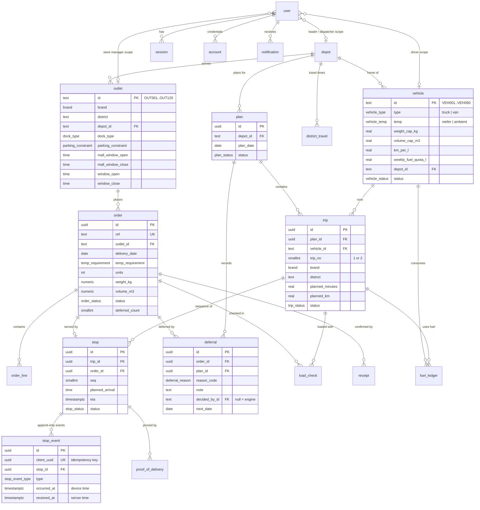
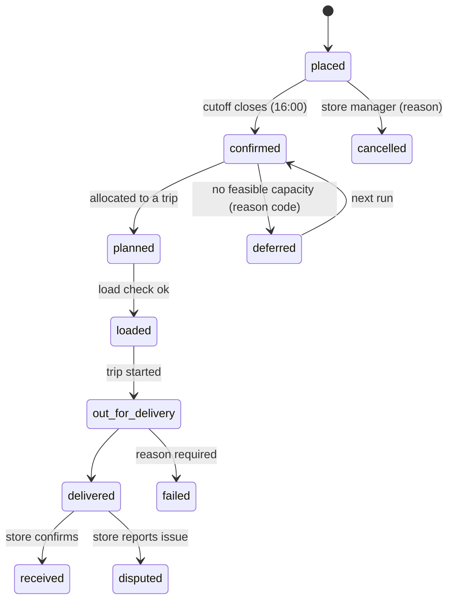

# Data model

PostgreSQL, defined in [`apps/backend/src/database/schema.ts`](../apps/backend/src/database/schema.ts) with Drizzle ORM. Migrations are generated into `apps/backend/drizzle/` and applied by the `seed` service on every `docker compose up`.

## Entity relationships

`audit_event`, `outbox_event`, `calendar_day`, `service_allowance` and `verification` stand alone and are left out of the diagram for readability.

## Tables by module

| Module | Tables | Notes |
| --- | --- | --- |
| Master data | `depot`, `outlet`, `vehicle`, `calendar_day`, `district_travel`, `service_allowance` | Loaded from `data/seed/*.csv` by an idempotent upsert. `vehicle.status` is operational and is not overwritten by re-seeding. |
| Identity | `user`, `session`, `account`, `verification` | Better Auth schema (username + admin plugins). `user.role` holds `dispatcher`, `loader`, `driver`, `store_manager` or `admin`. `outlet_id`, `depot_id` and `vehicle_id` are the RBAC scope. |
| Ordering | `order`, `order_line` | `ref` is the human-readable key (e.g. `ORD0092308`). `deferred_count` highlights repeated skips. |
| Planning | `plan`, `trip`, `stop`, `deferral` | One plan per depot per day. `trip_no` is limited to 1 or 2. A stop links exactly one order (whole orders, no splitting). |
| Fleet | `fuel_ledger` | Litres = km / `km_per_l`, summed per vehicle per ISO week against `weekly_fuel_quota_l`. |
| Loading | `load_check` | `checked_by_name` supports the shared loader tablet. |
| Execution | `stop_event`, `proof_of_delivery` | Append-only. `client_uuid` makes offline replays idempotent. Both device time and server time are kept. |
| Receipt | `receipt` | `received`, `received_with_issues` or `disputed`, with an issues list. |
| Notifications | `notification` | Per user or per outlet. Fanned out over SSE. |
| Audit | `audit_event` | See below. |
| Events | `outbox_event` | Transactional outbox, relayed by the worker. |

## Order state machine

## Audit trail rules

1. **Same transaction.** Domain services write `audit_event` in the same Drizzle transaction as the change. If the audit write fails, the change rolls back.
2. **Append-only.** A trigger blocks `UPDATE`, `DELETE` and `TRUNCATE` on `audit_event` (see [`audit-append-only.sql`](../apps/backend/src/database/sql/audit-append-only.sql)). In production, the app's DB role should also be limited to `INSERT` and `SELECT` on that table.
3. **Tamper-evident.** `hash = sha256(prev_hash + canonical row)`. A nightly worker job re-walks the chain.
4. **Mandatory reasons** for deferrals, manual overrides, edits after publish, failed or partial deliveries, missing or damaged items, cancellations, and disputes.
5. **Two clocks.** `occurred_at` (device) and `recorded_at` (server), stored in UTC and shown in Asia/Colombo. Late offline events are flagged, not reordered.
6. **Idempotent.** A unique `client_uuid` prevents duplicate rows from replays.

## Conventions

- Clock-only values (delivery windows) use `time`. Instants use `timestamptz` in UTC. The business time zone is `Asia/Colombo`.
- Enum values are defined once in `@waypoint/shared` and reused by the DB enums, the API DTOs and the UI.
- Change the schema, then run `pnpm db:generate` and commit the SQL in `apps/backend/drizzle/`. Never edit a migration that has been merged.
